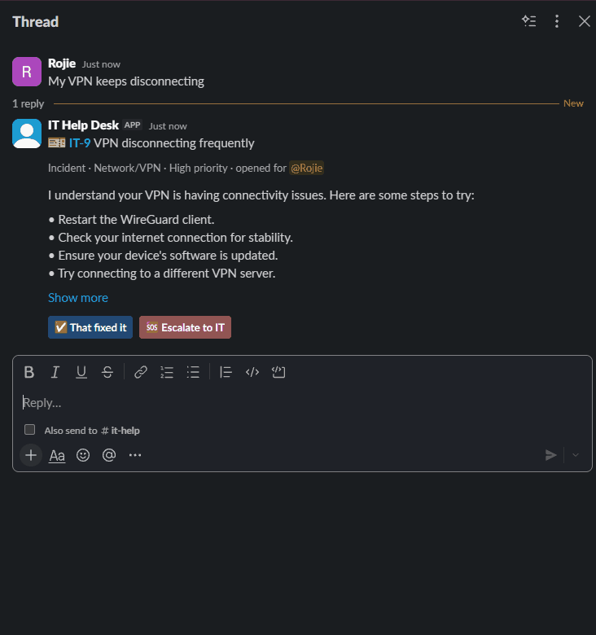
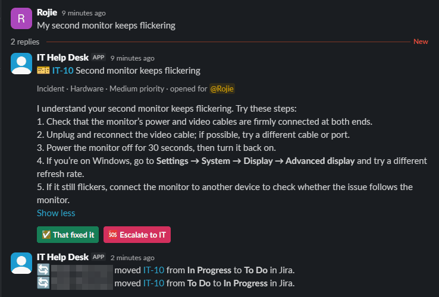

# Slack + Jira IT Help Desk Bot

[](https://github.com/RojMacar24/slack-it-chatbot/actions/workflows/tests.yml)

**A Slack bot that turns IT requests into triaged Jira tickets, answers with first-line troubleshooting, and keeps
each ticket up to date with the Slack conversation until the problem is solved.**

<p align="center">
  
</p>
<p align="center"><em>A real run in a lab Slack workspace and Jira Cloud site, with the waiting time sped up.</em></p>

## Highlights

- **End-to-end automation.** A Slack post becomes a typed, prioritised, labelled Jira ticket within seconds. Thread
  replies become Jira comments, buttons in Slack resolve or escalate the ticket in Jira, and status changes made in
  Jira come back to the Slack thread.
- **AI with guardrails.** OpenAI returns structured triage that the bot validates, with a keyword-rule fallback, so
  tickets still flow when there's no API key or the API fails. The AI steps back as soon as someone from IT joins.
- **Built for real conversations.** Greetings get asked for details, split messages merge into one ticket, replies
  sent while a ticket is being created aren't lost, and two quick replies get one answer.
- **Secure by default.** Passwords and tokens are masked before anything reaches Jira or OpenAI, AI output is escaped
  so it can't ping a whole channel, and the Slack app asks only for the permissions it uses.
- **Simple to run, thoroughly tested.** No database (Jira is the source of truth) and no public URL (Slack Socket
  Mode). Over 200 automated tests with fake Slack, Jira and OpenAI clients run on Linux and Windows on every pull
  request.

**Tech:** Python 3.12 · Slack Bolt (Socket Mode, Block Kit) · Jira REST API (Cloud and Data Center) · OpenAI API ·
APScheduler · pytest · GitHub Actions

## What it does

A self-contained lab project that automates first-line IT support between Slack and Jira:

- New posts in your IT channel become **Jira tickets**, each typed, categorised, prioritised and labelled. A greeting
  gets asked for details first, and quick follow-up posts join the same ticket.
- The bot replies in the Slack thread with the ticket link and, if OpenAI is configured, **first troubleshooting steps**.
- Replies in the thread are **copied into Jira as comments**, so the ticket holds the whole conversation.
- The requester can press **✅ That fixed it**, which closes the Jira ticket, or **🆘 Escalate to IT**, which labels it and pings your IT group.
- When IT **changes a ticket's status in Jira**, the bot posts it in the Slack thread, and closing it there takes the buttons away.
- The AI stops replying as soon as someone from IT joins the thread (a coworker's "+1" doesn't count), the ticket is escalated or closed, or it has run out of attempts.
- A **weekly report**, built from Jira data, is posted to the channel. You can also get one any time with `@IT Help Desk report`.

It runs over Slack **Socket Mode**, so it needs no public URL, web server or database. You can run it on a laptop.

```text
 Slack #it-help                      helpdesk/                       Jira
 ──────────────                      ─────────                       ────
 "VPN keeps dropping"  ──event──▶  triage (AI or keywords)  ──────▶  create IT-42
                                                                     (labels, priority)
 thread: 🎫 IT-42 + steps  ◀──────  post ticket + first reply  ────▶  comment: AI reply
 "still failing"       ──event──▶  AI follow-up             ──────▶  comment: both messages
 [✅ That fixed it]     ──button─▶  transition to Done       ──────▶  IT-42 → Done
 [🆘 Escalate to IT]    ──button─▶  label "escalated"        ──────▶  IT-42 + label, comment
 thread: "moved to Done"  ◀──────  check for changes (1 min) ◀─────  IT moves IT-42 → Done
```

## Run it yourself

The bot runs on a laptop with free Slack and Jira accounts; OpenAI is optional. **[docs/SETUP.md](docs/SETUP.md)** walks
through it step by step in about 45 minutes, and lists every setting, how to deploy it and how to troubleshoot it.

## Project layout

```text
helpdesk/                  the bot (run it with: python -m helpdesk)
├── bot.py                 Slack event and button handlers, ticket lifecycle, Jira sync, schedule
├── jira_client.py         small Jira REST client for Jira Cloud and Data Center
├── assistant.py           triage and troubleshooting with OpenAI, falling back to keyword rules
├── tickets.py             how ticket messages look in Slack, and how the bot recognises its threads
├── reports.py             the weekly summary, built from Jira search results
├── text_utils.py          converts Slack and Markdown text, and masks secrets
└── config.py              reads and checks the settings from the environment or .env
tests/                     offline tests with fake Slack, Jira and OpenAI clients
docs/
├── SETUP.md               step-by-step setup, every setting, deploying and troubleshooting
├── slack-app-manifest.yml creates the Slack app with the right permissions in one step
├── it_environment.md      describes your lab's tools, sent to the AI so its advice fits
├── demo.gif               the demo at the top of this page
└── jira-sync.png          the Jira-to-Slack screenshot above
requirements*.in / .txt    dependency ranges, and the hashed lock files generated from them
```

## How it works

**Triage.** With OpenAI configured, one model call returns the ticket type (incident, access request or change
request), category, priority, a short ticket title, and the first reply, all as JSON. Invalid values fall back to the
keyword rules, and so does any API failure. Access and change requests get an acknowledgement instead of troubleshooting.

**Jira labels.** Each ticket gets `slack-it-bot` (or your `JIRA_LABEL`), its type (`incident`, `access-request` or
`change-request`) and `category-<name>`. Escalated tickets also get `escalated`. This makes JQL filters and Jira
automation rules easy, for example `labels = escalated AND statusCategory != Done`.

**Reporter.** When the bot's Jira account is allowed to set the reporter, it looks up the requester's Slack email and
makes the matching Jira user the reporter, so the ticket shows up under *Reported by me*. It only accepts one exact,
visible email match, never a partial one. Otherwise the bot's account stays the reporter, and the description always
names who asked.

**Greetings and split posts.** People rarely put a whole problem in one message:

- A post with no details yet, like "Hi team", "quick question" or "I have a problem", gets a reply asking what's
  going on. When that person answers in the thread, the ticket opens there.
- If the same person posts again within `MERGE_WINDOW_SECONDS` (2 minutes by default), the new post joins their
  last ticket instead of opening another. It's added to Jira as a comment, the new post gets a link back to the
  ticket thread, and the AI answers there with the new detail in mind. Replies under the extra post are copied to
  the ticket too.

**Timing.** A reply sent while its ticket is still being created waits for it instead of being dropped. Replies in the
same thread are handled one at a time. If someone sends two messages in quick succession, the AI answers once,
covering both.

**Jira to Slack.** Socket Mode has no public URL for a Jira webhook, so every `JIRA_SYNC_SECONDS` (1 minute by default)
the bot asks Jira which of its tickets changed recently, with their change history. It posts each status change a
person made, such as "Alex Kim moved IT-42 from To Do to In Progress in Jira", in the ticket's Slack thread. The
bot finds that thread from the link in the ticket description, and checks that the thread really is that ticket's
before posting. Its own changes are skipped, since it already announced them. When a ticket reaches a Done status,
its buttons come off, just as if the requester had pressed **That fixed it**.

<p align="center">
  
</p>
<p align="center"><em>Two status changes made in Jira, posted in the ticket's Slack thread within a minute.</em></p>

**No database.** The bot recognises its tickets from its own thread message, which starts with
"Ticket IT-42 created". The requester is whoever started the thread. Jira is the source of truth for status and
labels, so closing or labelling a ticket directly in Jira also stops the AI. The only things kept in memory are
short-lived:

- tickets still being created
- each person's latest ticket, for the merge window
- how many tickets each person opened in the last hour, for the limit
- which Jira changes have been posted already

A restart forgets those and nothing else. Changes made in Jira while the bot is stopped aren't posted afterwards.

**When the AI stays quiet.** It only replies to the person who opened the ticket, and only on incidents. It stops when:

- someone from IT replies in the thread. Set `IT_STAFF` to say who that is; then a coworker's "+1, same here"
  doesn't silence it. Without `IT_STAFF`, a reply from anyone but the requester counts
- the ticket is escalated or closed
- it has used up `MAX_AI_FOLLOW_UPS`, after which it posts one final suggestion to escalate

Everyone's replies are still copied to Jira.

**Limits.** One person can open up to `MAX_TICKETS_PER_HOUR` tickets an hour (10 by default). Past that, the bot asks
them to add to an open ticket instead, before any AI or Jira call is made. Extra posts merged into a ticket and
greeting prompts don't count.

**Buttons.** Only the requester can use them. Anyone else gets a private note saying so. To close a ticket, the bot
picks a transition into a Done-category status, preferring names like Done, Resolve or Close. It never uses
cancel-style transitions ("Cancel", "Won't do", "Duplicate"). If the transition asks for a resolution, it fills in
Done or Fixed. Set `JIRA_DONE_TRANSITION` to override the choice. Once a ticket is closed or escalated, the buttons
come off every message in its thread.

## Tests

```bash
uv venv
uv pip install -r requirements-dev.txt
uv run pytest
```

The tests use in-memory fakes for Slack, Jira and OpenAI, so they need no accounts or network. One test sends real
Slack event and button payloads through Bolt's router to check the wiring. GitHub Actions runs the same tests and a
`pyflakes` lint on both Linux and Windows, on every push to `main` and every pull request
(`.github/workflows/tests.yml`).

## Ideas for extending the lab

- **Jira comments in Slack:** status changes already reach the thread. Comments from IT could too, and a reply in
  Slack could go back as a comment visible to the requester.
- **Knowledge base:** search Confluence or a docs folder and include the matching articles in the AI prompt.
- **Jira Service Management:** map incident and request types to JSM request types and SLAs.
- **Another AI provider:** everything model-specific is in `helpdesk/assistant.py`.

See [SECURITY.md](SECURITY.md) for how data and credentials are handled.

## Author and copyright

Built by Rojie M. ([@RojMacar24](https://github.com/RojMacar24)).

© 2026 Rojie M. All rights reserved. No license is granted to copy, modify or redistribute this code. You're welcome to
read it; please ask before reusing any of it.
